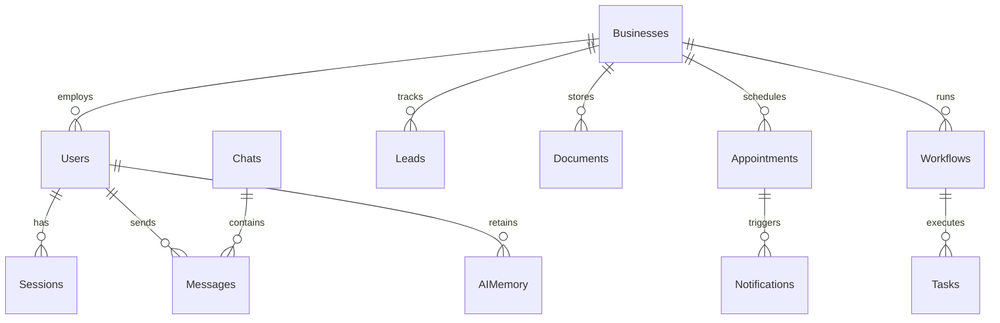

# Database Schemas & Data Model Design

The AI Business Copilot uses **MongoDB Atlas** as the primary document store, supplemented by **Redis** for session management and token rate limiting, and a **Vector Database** (e.g., Pinecone/HNSWLib) for semantic similarity and long-term context storage.

---

## Entity Relationship Overview

MongoDB is document-oriented, but we enforce clear references (`ObjectId`) to maintain referential integrity. Below are the schemas and relationship strategies for our 13 collections:



---

## Collection Schemas

### 1. Users (`users`)
Stores profile, authentication mappings, role assignments, and reference to the business.
```typescript
interface User {
  _id: ObjectId;
  businessId: ObjectId;      // Reference to Businesses collection
  email: string;             // Indexed, Unique
  passwordHash?: string;     // Nullable for OAuth/Firebase users
  firebaseUid?: string;      // Indexed, unique authentication identifier
  firstName: string;
  lastName: string;
  role: 'admin' | 'manager' | 'employee' | 'customer';
  phoneNumber?: string;
  avatarUrl?: string;
  isActive: boolean;
  createdAt: Date;
  updatedAt: Date;
}
```
**Indexes**:
- `email`: 1 (Unique)
- `firebaseUid`: 1 (Sparse, Unique)
- `businessId`: 1

---

### 2. Businesses (`businesses`)
Stores tenant information for multi-tenant isolation.
```typescript
interface Business {
  _id: ObjectId;
  name: string;
  domain?: string;
  subscriptionPlan: 'free' | 'growth' | 'enterprise';
  settings: {
    workHours: {
      start: string; // e.g. "09:00"
      end: string;   // e.g. "17:00"
      timezone: string; // e.g. "UTC", "America/New_York"
    };
    aiConfig: {
      autoSchedule: boolean;
      voiceGreetingName?: string;
      customPromptContext?: string;
    };
  };
  createdAt: Date;
  updatedAt: Date;
}
```

---

### 3. Appointments (`appointments`)
Manages scheduling slot availability, statuses, and links patients/customers.
```typescript
interface Appointment {
  _id: ObjectId;
  businessId: ObjectId;
  customerId?: ObjectId;      // References Users if registered
  customerName: string;       // Guest checkout support
  customerEmail: string;
  customerPhone: string;
  title: string;
  description?: string;
  startTime: Date;            // Indexed
  endTime: Date;              // Indexed
  status: 'pending' | 'confirmed' | 'cancelled' | 'no-show' | 'completed';
  assignedTo?: ObjectId;      // References Users (employee/doctor/agent)
  source: 'chat' | 'voice' | 'manual' | 'portal';
  reminderSent: boolean;
  createdAt: Date;
  updatedAt: Date;
}
```
**Indexes**:
- `businessId`: 1, `startTime`: 1, `endTime`: 1 (Compound index to detect conflicts)
- `customerEmail`: 1

---

### 4. Notifications (`notifications`)
Stores messages routed via Socket.io (real-time) or queued to Firebase Push/SMS/WhatsApp.
```typescript
interface Notification {
  _id: ObjectId;
  businessId: ObjectId;
  recipientId: ObjectId;      // References Users
  title: string;
  body: string;
  type: 'appointment' | 'lead' | 'system' | 'mention';
  priority: 'low' | 'medium' | 'high';
  status: 'unread' | 'read' | 'failed' | 'sent';
  channels: ('websocket' | 'firebase' | 'email' | 'sms' | 'whatsapp')[];
  metadata?: Record<string, any>;
  createdAt: Date;
  updatedAt: Date;
}
```
**Indexes**:
- `recipientId`: 1, `status`: 1
- `createdAt`: 1 (TTL index for 30-day auto-purge if requested)

---

### 5. Leads (`leads`)
Tracks customer acquisition pipelines and priorities.
```typescript
interface Lead {
  _id: ObjectId;
  businessId: ObjectId;
  name: string;
  email: string;
  phone?: string;
  source: string; // e.g., 'website', 'referral', 'chat'
  status: 'new' | 'contacted' | 'qualified' | 'proposal' | 'won' | 'lost';
  priority: 'low' | 'medium' | 'high';
  assignedTo?: ObjectId; // References Users
  value?: number;
  notes: string[];
  aiSuggestions: string[]; // Suggestions calculated by AI Analysis Agent
  createdAt: Date;
  updatedAt: Date;
}
```
**Indexes**:
- `businessId`: 1, `status`: 1
- `email`: 1

---

### 6. Analytics (`analytics`)
Consolidates business intelligence metrics.
```typescript
interface Analytics {
  _id: ObjectId;
  businessId: ObjectId;
  date: Date; // e.g. Day boundary
  metrics: {
    totalRevenue: number;
    totalLeads: number;
    convertedLeads: number;
    totalAppointments: number;
    cancelledAppointments: number;
    aiHandledQueries: number;
  };
  aiInsights: {
    summary: string;
    recommendations: string[];
    sentimentScore: number;
  };
  createdAt: Date;
}
```
**Indexes**:
- `businessId`: 1, `date`: -1 (Unique combination)

---

### 7. Documents (`documents`)
Stores records of raw documents, OCR text extractions, and metadata mapping.
```typescript
interface Document {
  _id: ObjectId;
  businessId: ObjectId;
  uploadedBy: ObjectId; // References Users
  fileName: string;
  fileSize: number;
  fileType: string; // e.g., 'application/pdf', 'image/png'
  storageUrl: string; // Firebase storage or MinIO path
  ocrStatus: 'pending' | 'processing' | 'completed' | 'failed';
  extractedText?: string;
  parsedData?: Record<string, any>; // JSON structured fields (e.g. invoice items, total, vendor)
  summary?: string; // AI Summarized text
  tags: string[];
  createdAt: Date;
  updatedAt: Date;
}
```
**Indexes**:
- `businessId`: 1
- `tags`: 1

---

### 8. Sessions (`sessions`)
Tracks user logins, device footprints, and JWT validity.
```typescript
interface Session {
  _id: ObjectId;
  userId: ObjectId; // References Users
  refreshToken: string; // Stored securely to validate rotations
  userAgent?: string;
  ipAddress?: string;
  expiresAt: Date; // TTL Indexed
  createdAt: Date;
}
```
**Indexes**:
- `userId`: 1
- `refreshToken`: 1
- `expiresAt`: 1 (TTL Index)

---

### 9. AI Memory (`ai_memory`)
Stores stateful memory for chat context extraction, tracking user preferences.
```typescript
interface AIMemory {
  _id: ObjectId;
  businessId: ObjectId;
  entityId: string; // Can map to a customerId, email, or telephone number
  entityType: 'customer' | 'lead' | 'employee';
  facts: string[]; // List of facts deduced by AI Memory Agent
  preferences: Record<string, any>;
  lastInteractionAt: Date;
  createdAt: Date;
  updatedAt: Date;
}
```
**Indexes**:
- `businessId`: 1, `entityId`: 1 (Compound Unique)

---

### 10. Chats (`chats`)
Contains communication channel logs.
```typescript
interface Chat {
  _id: ObjectId;
  businessId: ObjectId;
  participants: {
    id: ObjectId | string; // Can be UserId or guest Session string
    role: 'customer' | 'employee' | 'agent';
  }[];
  channel: 'web' | 'whatsapp' | 'voice';
  status: 'active' | 'archived' | 'pending_human';
  lastMessageAt: Date;
  createdAt: Date;
  updatedAt: Date;
}
```
**Indexes**:
- `businessId`: 1
- `lastMessageAt`: -1

---

### 11. Messages (`messages`)
Sub-document message items linked to `Chats`.
```typescript
interface Message {
  _id: ObjectId;
  chatId: ObjectId; // References Chats
  sender: {
    id?: ObjectId; // Null if system or guest
    role: 'customer' | 'employee' | 'agent';
    name: string;
  };
  content: string;
  contentType: 'text' | 'voice' | 'attachment';
  attachmentUrl?: string;
  sentiment?: 'positive' | 'neutral' | 'negative';
  createdAt: Date;
}
```
**Indexes**:
- `chatId`: 1, `createdAt`: 1

---

### 12. Tasks (`tasks`)
Sub-tasks triggered by autonomous workflows.
```typescript
interface Task {
  _id: ObjectId;
  workflowId: ObjectId; // References Workflows
  name: string;
  description?: string;
  status: 'pending' | 'running' | 'completed' | 'failed';
  assignedToAgent: string; // e.g. 'SchedulerAgent'
  inputParams: Record<string, any>;
  outputResult?: Record<string, any>;
  errorLog?: string;
  dependsOn?: ObjectId[]; // Execution dependencies
  createdAt: Date;
  updatedAt: Date;
}
```

---

### 13. Workflows (`workflows`)
Orchestrates autonomous multi-agent task flows.
```typescript
interface Workflow {
  _id: ObjectId;
  businessId: ObjectId;
  initiator: {
    type: 'customer' | 'system' | 'employee';
    id: string; // e.g. customer Email or User ID
  };
  triggerInput: string; // Original request: e.g. "Book appointment tomorrow morning"
  status: 'initiated' | 'executing' | 'completed' | 'failed' | 'paused';
  currentStepIndex: number;
  steps: ObjectId[]; // References Tasks in order
  createdAt: Date;
  updatedAt: Date;
}
```
**Indexes**:
- `businessId`: 1
- `status`: 1
